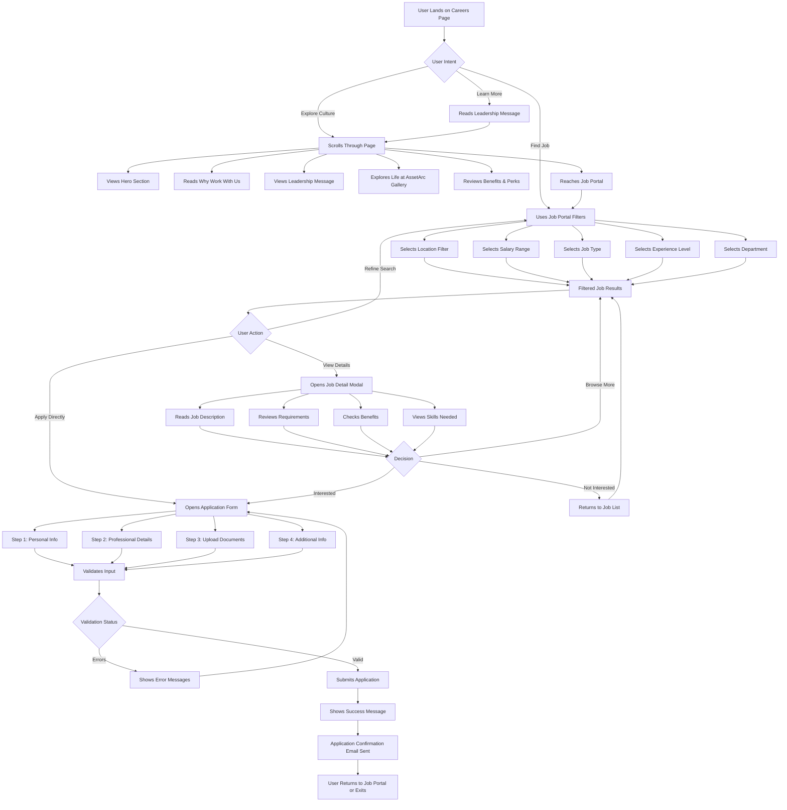
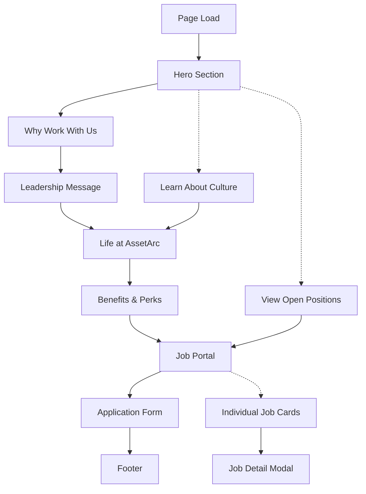
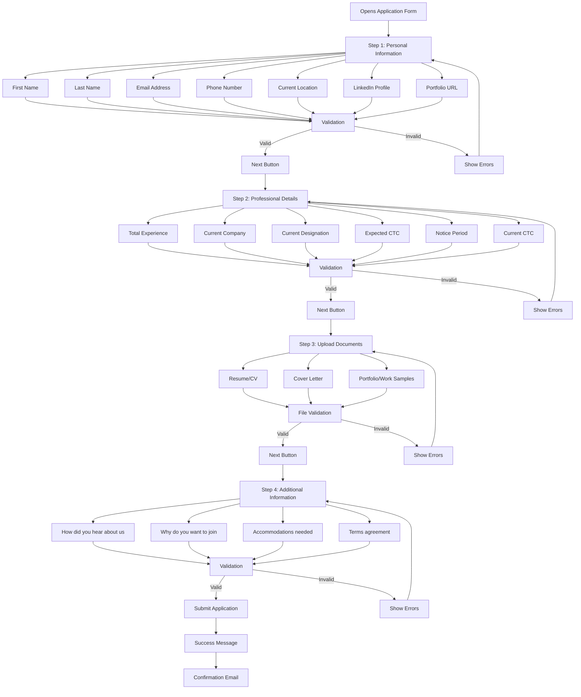
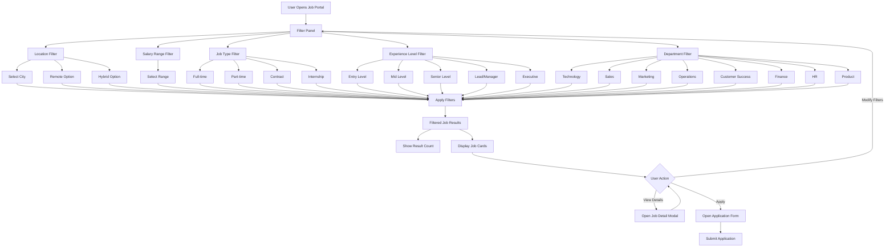
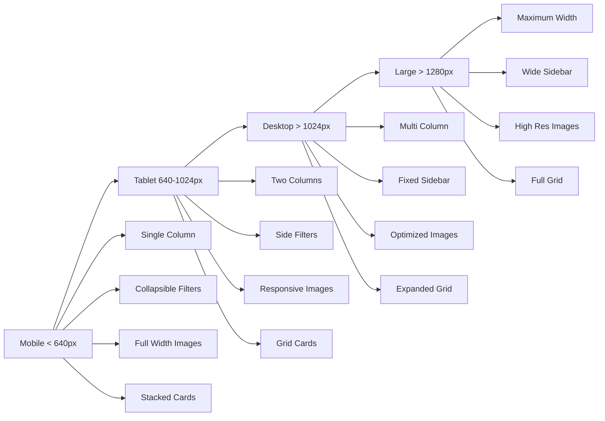
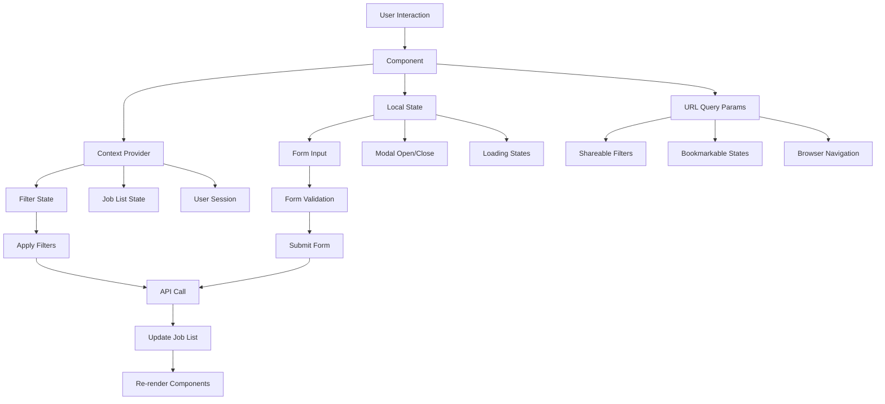

# AssetArc Careers Page - User Journey & Visual Flow

## User Journey Flowchart

## Page Scroll Flow

## Application Form Flow

## Filter System Flow

## Component Hierarchy

```mermaid
graph TD
    Page[Careers Page] --> Hero[HeroSection]
    Page --> ValueProp[ValueProposition]
    Page --> Leadership[LeadershipMessage]
    Page --> Culture[CultureShowcase]
    Page --> Benefits[BenefitsSection]
    Page --> JobPortal[JobPortal]
    Page --> Application[ApplicationForm]
    Page --> Footer[Footer]
    
    Hero --> HeroContent[Hero Content]
    Hero --> HeroCTA[CTA Buttons]
    Hero --> HeroBg[Background Image]
    
    ValueProp --> VP1[Growth Card]
    ValueProp --> VP2[Impact Card]
    ValueProp --> VP3[Culture Card]
    
    Leadership --> LQuote[Quote Block]
    Leadership --> LImage[Founder Image]
    Leadership --> LAttribution[Attribution]
    
    Culture --> CGallery[Image Gallery]
    Culture --> CCaptions[Image Captions]
    
    Benefits --> B1[Health Card]
    Benefits --> B2[Financial Card]
    Benefits --> B3[WorkLife Card]
    Benefits --> B4[Growth Card]
    Benefits --> B5[Family Card]
    Benefits --> B6[Office Card]
    Benefits --> B7[Recognition Card]
    Benefits --> B8[Community Card]
    
    JobPortal --> JFilters[FilterSidebar]
    JobPortal --> JList[JobList]
    JobPortal --> JPagination[Pagination]
    
    JFilters --> FLocation[Location Filter]
    JFilters --> FSalary[Salary Filter]
    JFilters --> FType[Job Type Filter]
    JFilters --> FExp[Experience Filter]
    JFilters --> FDept[Department Filter]
    
    JList --> JobCard1[Job Card 1]
    JList --> JobCard2[Job Card 2]
    JList --> JobCardN[Job Card N]
    
    JobCard1 --> JCBadge[Department Badge]
    JobCard1 --> JCTitle[Job Title]
    JobCard1 --> JCMeta[Meta Info]
    JobCard1 --> JCButton[View Details Button]
    
    Application --> AProgress[ProgressBar]
    Application --> AStep1[Step 1: Personal Info]
    Application --> AStep2[Step 2: Professional Info]
    Application --> AStep3[Step 3: Documents]
    Application --> AStep4[Step 4: Additional Info]
    Application --> ANavigation[Navigation Buttons]
    
    AStep1 --> Form1[Form Fields]
    AStep2 --> Form2[Form Fields]
    AStep3 --> Form3[File Uploads]
    AStep4 --> Form4[Form Fields]
```

## Responsive Layout Breakpoints

## State Management Flow

---

*Document Version: 1.0*
*Last Updated: April 2026*
*Companion to: assetarc-careers-page-blueprint.md*
